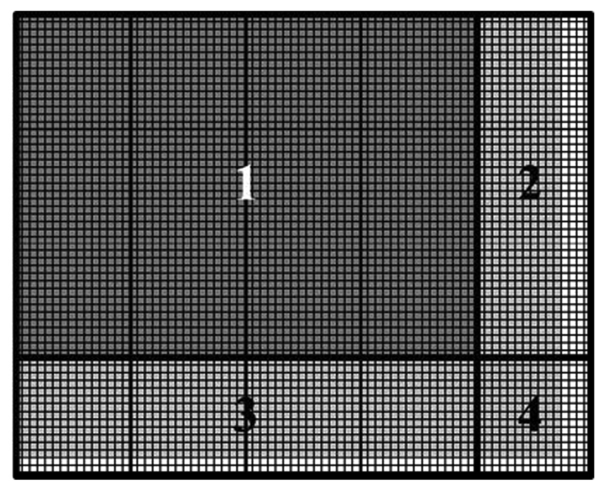
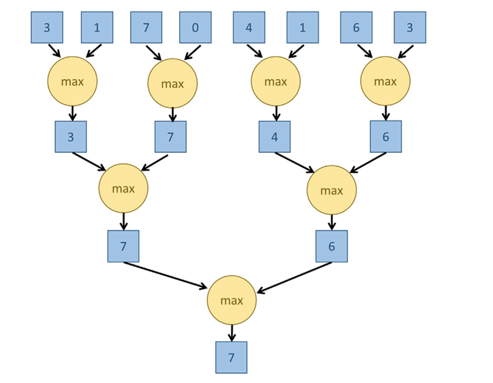

# CUDA 100 Days Learning Journey

Progress of the challenging [CUDA 100 Days Learning Journey](https://github.com/hkproj/100-days-of-gpu/tree/main).

Mentor: https://github.com/hkproj/

+ Day 1: Add two vectors
+ Day 2: Add two matrices
> Grid and Block dimensions are determined by the dimensions of matrix, usually pad the matrix dimensions multiple of 16 or 32 for better memory access pattern.
More details refer to PMPP p57.

2D-Blocks Covers Matrix Calculation
+ Day 3: Matrix-Vector multiplication. 
+ Day 4: Calculate the sum of a vector by tree-based reduction.
> Refer to PMPP chapter 10 Reduction. 
        Tree-Based-Reduction
